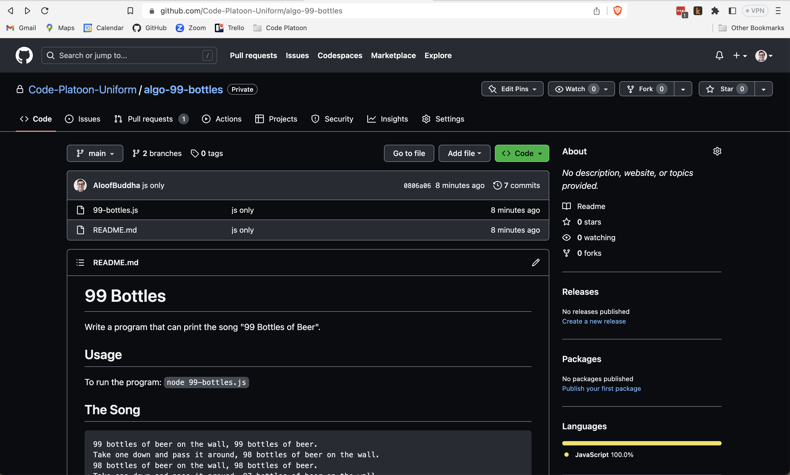
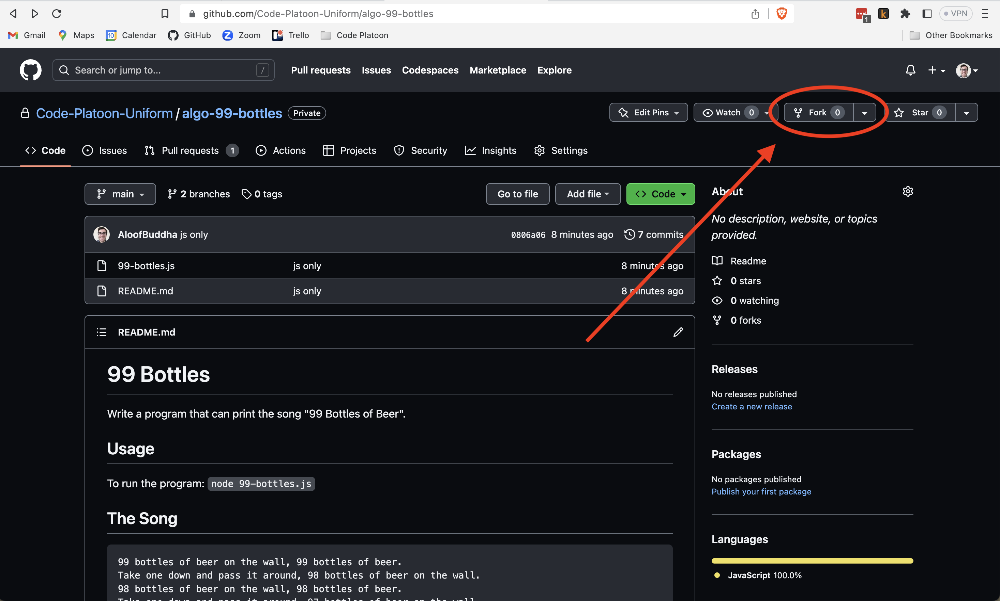
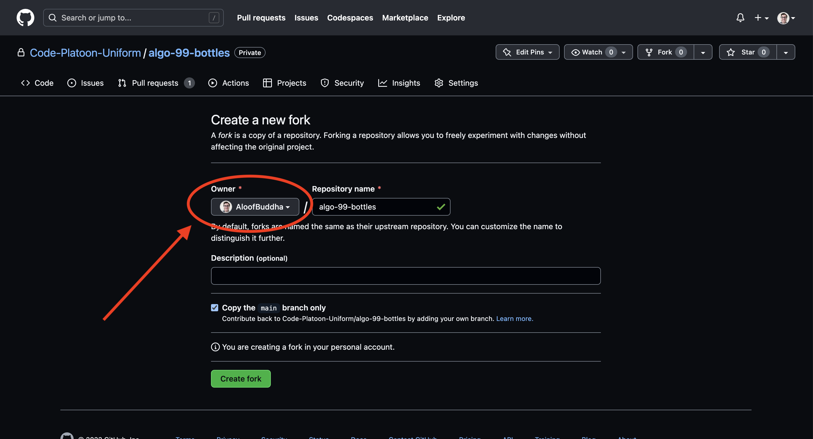
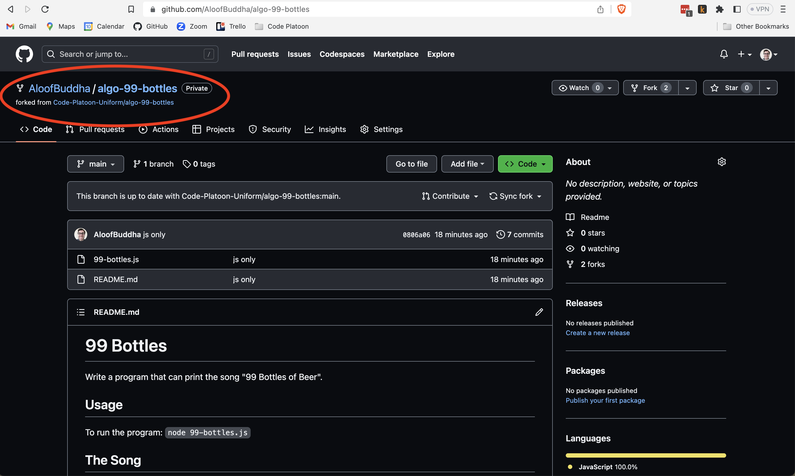
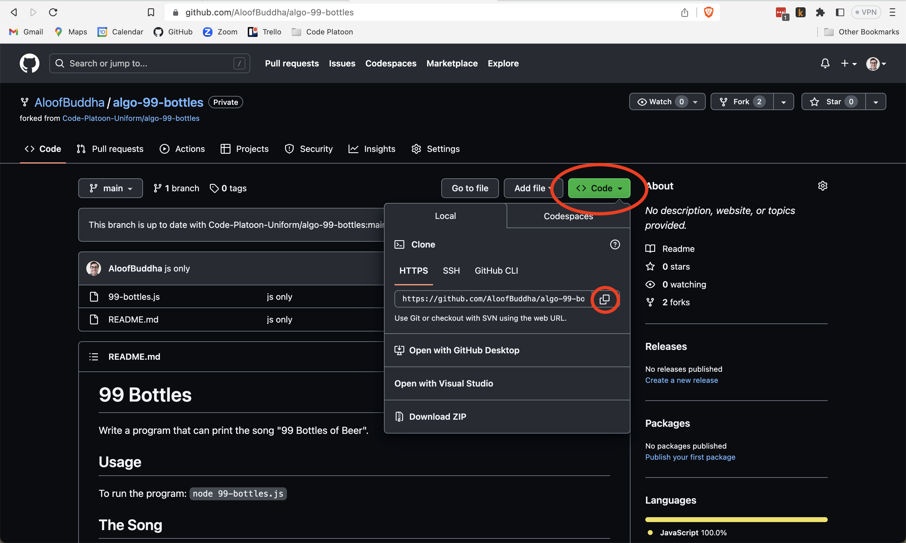
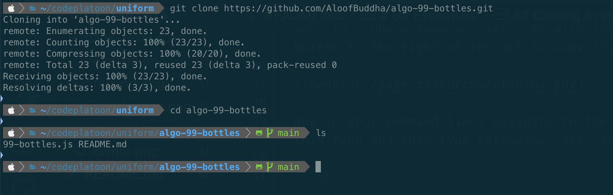
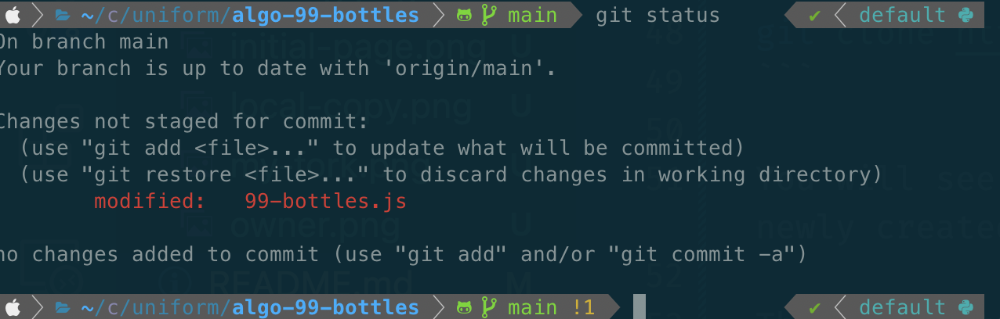
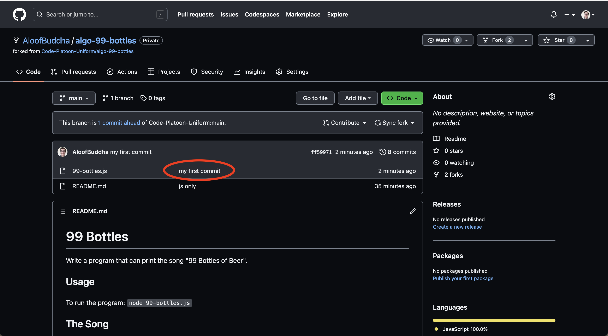

# Git Essentials

This is not an assignment as much as a resource for understanding the basics of using Git and Github to create a personal copy of any given assignment you complete. This is useful to keep track of your work but also so that your Github profile shows you have been actively programming!

> Note: we will go into much more depth with Git/Github tomorrow, this is just to get you started

## Forking a repo

We will use the first 'real' assigment of the day to show you how this might be done. The link is [here](https://github.com/Code-Platoon-Uniform/algo-99-bottles)

Assuming you already have a Github account and have access to the Uniform-Platoon organization (reach out to any instructor or TA on Slack *immediately* if you lack access) you should see something like below:



This is a canonical version of the assignment we have provided you. However, once you create a solution you may want to save these changes to your personal Github account. To do this, first you will need to make your own copy of the repo, a process known as 'forking'. In the top right of the page you should see a button labelled 'Fork', like below:



Click this button. On the following page you will see an dropdown for owner. Set the owner to your personal account:



Now click 'Create Fork'

After a few seconds you should be able to refresh and see this:



Notice that is is under your own account!

## Cloning a repo

Now, let's clone our newly created repo so we have a local copy.

You should see a button called 'Code' (if you can't see it maximize the browser window). Click this and you will see more info. There are a few ways to clone a repo but let's go with the simplest HTTPS. Click the button to the right of the url to copy it.



Now in your command line, navigate to the folder where you want to clone this repo and then type (assuming `git` is installed):

```sh
git clone <repo-url-from-above>
```

For me this looks like:

```sh
git clone https://github.com/AloofBuddha/algo-99-bottles.git
```

You will see some output if succesful and then you can `cd` into the newly created directory.

This is what it looks like for me:



## Making changes and pushing

So let's make a simple change just to see the process of pushing new work to our remote repo on Github.

Open `99-bottles.js` in VSCode and make any change you want and save it. **You don't need to solve the problem, just put a `console.log` in!**

Now go back to the command line and type `git status`. This will tell you the 'status' of your repo, i.e. if any new work was done.



Great, it knows about the new work!

Now let's 'stage' the new work, i.e. mark it as something we want to keep track of.

To do this type `git add .`. The `.` just means 'all files', it's usually what you want.

If you type `git status` again you should see the file in green, it is being tracked!

Now we want to create a 'commit'. A commit in git means a new set of changes you are ready to push to your Github repo.

Type `git commit -m "my first commit"` into the cli. the `-m` let's you provide a message, which is actually required and this is the simplest way.

Type git status again and you should see a message saying your local copy (branch 'main') is ahead of the Github version ('origin/main') by one commit.

Now type `git push`. This will push any new commits to the Github repo.

Now go back to your web browser and go to the Github repo and refresh.

You should see something like:



Notice the commit message is there, you pushed changes! Dig in and you will see your work is now back up. You can repeat this process every time you make new changes. Just keep in mind that you don't need to commit constantly, it's really only necessary once you have made real progress and want to record it somewhere accessible (ie Github, not just your own laptop)


